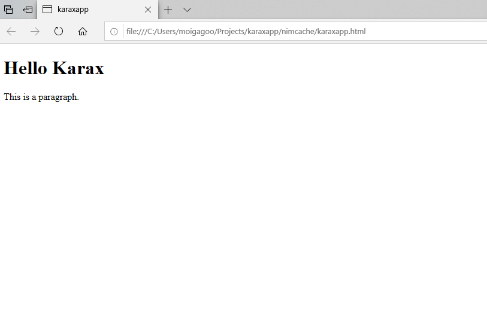
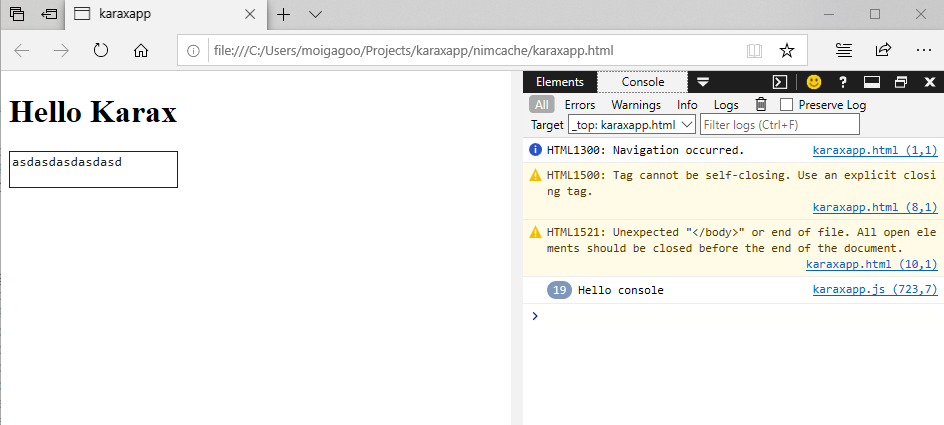
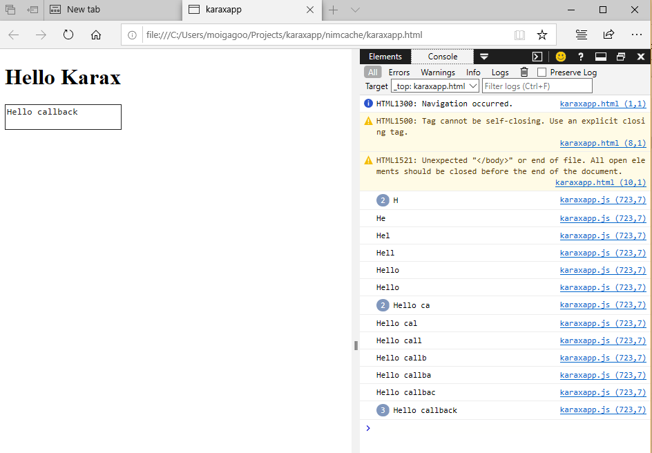
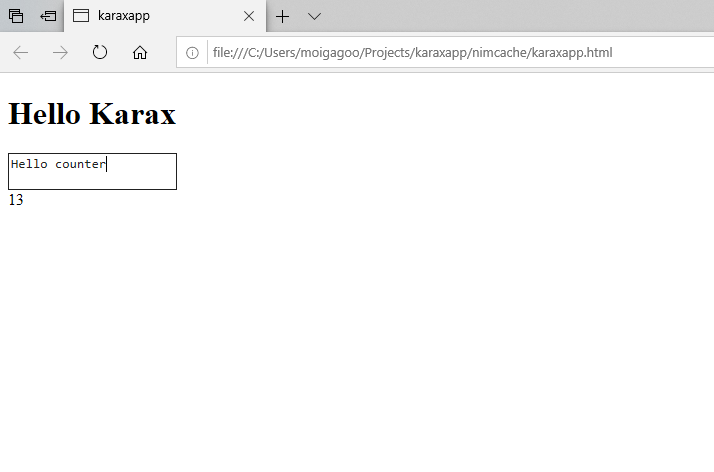
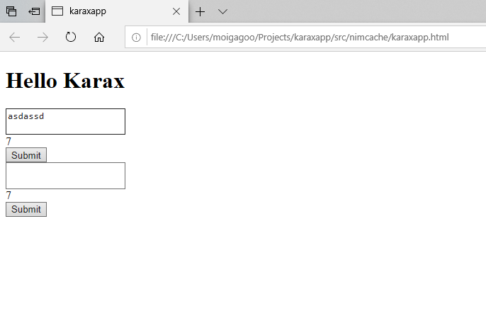
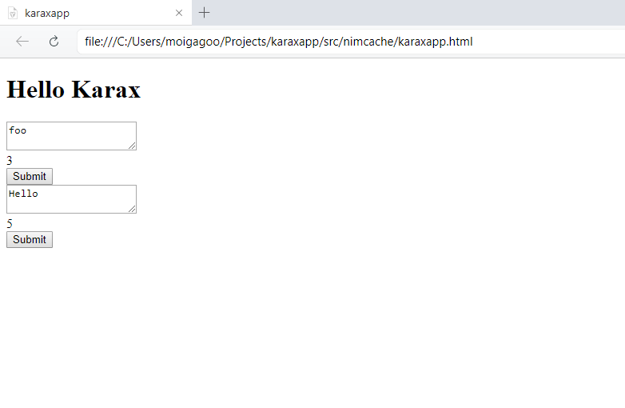
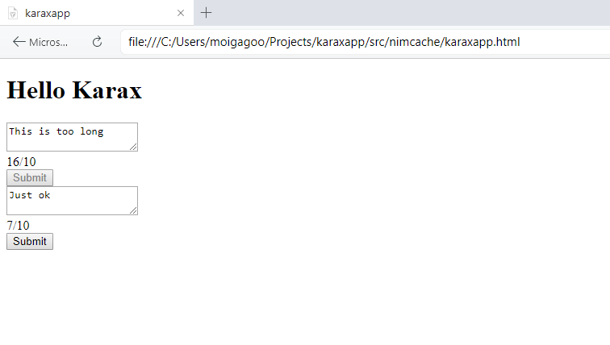

# Exploring Karax

I've been programming in Python for some ten years, but for the last couple of years Nim has become my new love.

In this short post I'm discovering Nim as a frontend language by exploring [Karax framework](https://github.com/pragmagic/karax). Note that I'm not a frontend developer and am pretty scared of the concepts those guys deal with. This is a journey for me as much as it is for you.


## Installing Karax

First, install Karax with `nimble install karax@#head`. This command installs the latest Karax dev version library and a few useful commands including `karun`, which we'll use later.

> Of course, you should have Nim and Nimble installed before installing Karax. [Choosenim](https://github.com/dom96/choosenim) is the right way to install them.


## Creating Project

Create a new directory and switch to it:

```shell
$ mkdir karaxapp
$ cd karaxapp
```

Create `src` directory with `karaxapp.nim` file:

```shell
$ mkdir src
$ touch src/karaxapp.nim
```

> Normally, when developing with Nim, you'd start a new project with `nimble init`. But in our case, there's no need for that: our app is neither a library, a binary, or a hybrid, so our app won't benefit from Nimble until we write some custom commands.

Now, open `src/karaxapp.nim` in your favorite editor. I use [VSCode](https://code.visualstudio.com/), and if you don't have a favorite yet, I recommend using it.


## Basic App

Let's populate the file with code, step by step.

First, we need to import some essential Karax submodules. Luckily, there's a neat shortcut for that:

```nim
include karax/prelude
```

> If you look inside [`karax/prelude.nim`](https://github.com/pragmagic/karax/blob/master/karax/prelude.nim) file, you'll see just a bunch of imports. These are the things most Karax apps use, that's why they are collected in a separate file.

Then, add `render` proc. It will be executed by Karax in the browser in an endless tight loop and is responsible for rendering the HTML output you'll see on the page.

```nim
proc render(): VNode =
  buildHtml(tdiv):
    h1(text "Hello Karax")

    p:
      text "This is a paragraph."
```

In the example above, we're telling Karax to update the page with the same static content over and over again.

`render` proc returns a `VNode`, which represents a *virtual DOM* node. Virtual DOM is a concept implemented by many SPA frameworks like React and Vue. The idea is that modifying the actual DOM tree is expensive, so instead of updating the DOM, the framework updates an intermediate entity called virtual DOM. The framework tracks the diff between the virtual DOM states and only this diff is rendered in the actual DOM. The developer can safely render the entire page; the framework cares about optimizing the render.

In the first line, we invoke `buildHtml` macro that enables the Karax DSL. It lets you build HTML with Nim syntax, using indent instead of tags. It's somewhat similar to HAML but a lot better.

> We invoke `buildHtml` with `tdiv` argument. This is the same as indeting a `tdiv` block under `buildHtml`. Nim's syntax flexibiloty lets you use different call styles to improve readibility.

`text` proc is used to set the content between the opening and closing HTML tags. So, the code above would get converted to this HTML code:

```html
<h1>Hello Karax</h1>

<p>This is a paragraph</p>
```

Last, add this line to tell Karax that `render` is the proc we want it to use to update the page:

```nim
setRenderer render
```

The complete file should look like this:

```nim
include karax/prelude


proc render(): VNode =
  buildHtml(tdiv):
    h1(text "Hello Karax")

    p:
      text "This is a paragraph."


setRenderer render
```

To build the app and see it in the browser, run `karun -r src/karaxapp.nim`. You should see this in your browser:



`karun -r <filename>` compiles a given Nim file into JS and embeds it into a minimal HTML file that's immediatelly opened in the browser. You could have created the HTML file, compiled Nim to JS, and opened the HTML file in browser manually, but karun saves you a few minutes on that.


## Events and Callbacks

Our page is pretty boring—nothing ever happens on it. Let's add a callback that will respond to an event on the page.

Import `sugar` module to unlock Nim's shortcut proc definition syntax by adding this line to the top of the file:

```nim
import sugar
```

Let's replace the `p` node with a `textarea`:

```nim
buildHtml(tdiv):
  h1(text "Hello Karax")

  textarea(onkeyup = () => (echo "Hello console"))
```

Compile and run with karun and open developer's console in the browser. Try typing in the textarea and see how “Hello console” gets output in the console:



Here, we've attached an anonymous proc to `onkeyup` attribute of the `textarea` node, thus registering a callback for `onKeyUp` event. Every time a key is pressed inside the textarea, the callback is called.

But how do we capture the content of the textarea? In Karax, a proc can be set as a callback if it has the type `() -> void` or `(event: Event, node: VNode) -> void`. In the example above, we used the first kind. To capture the emitted event and the responding node, we'll use the second one. `event` captures the event that triggerred the callback and `node` is the VNode that emitted it.

Let's make our callback echo the textarea content:

```nim
textarea(onkeyup = (event: Event, node: VNode) => (echo node.value))
```

> If you're using VSCode, you'll notice that the line with the callback definition will be underlined as if containing an error. This is caused by a bug in nimsuggest.

When the callback is called, `node` will hold the textarea node, and its `value` attribute will hold the textarea content.

The code so far:

```nim
include karax/prelude


proc render(): VNode =
  buildHtml(tdiv):
    h1(text "Hello Karax")

    textarea(onkeyup = (event: Event, node: VNode) => (echo node.value))

setRenderer render
```

Compile, run, and check the console:




## State

So, a VNode can access its own state via a callback argument, but what if one VNode wants to access another VNode's state? For example, what if we wanted to have a character counter under the textarea?

To accomplish that, we have to introduce a variable that's accesible by both nodes. Define a global variable `content` of type kstring:

```nim
var content: kstring = ""
```

Why `kstring` and not regular `string`? `kstring` is an alias for `cstring` on JS backend and `string` when compiled to native targets. You will probably never compile Karax code to C, but it's a good habit to avoid implementation details in favor of abstractions. In Karax, `kstring` is an abstraction for “a piece of text,” so we'll use it whenever we need text.

Now let's make the textarea's callback mutate this variable and create another node that will read from it:

```nim
textarea(onkeyup = (event: Event, node: VNode) => (content = node.value))

tdiv:
  span(text $content.len)
```

`karaxapp.nim` should look like this:

```nim
include karax/prelude


var content: kstring = ""


proc render(): VNode =
  buildHtml(tdiv):
    h1(text "Hello Karax")

    textarea(onkeyup = (event: Event, node: VNode) => (content = node.value))

    tdiv:
      span(text $content.len)


setRenderer render
```

After compilation, the code renders to this:



Note that we don't have to do anything to make the state variable reactive to the VNodes' states. Since Karax calls `render` all the time and it's a regular Nim proc and `content` is a regular Nim variable, the textarea sets `content` in one tick and span gets the new value with the next one.


## Components

Our app is rather small so we can add new nodes directly into the render proc. But as the app grows, it quickly becomes unmaintainable if you keep everything in one file. The right way is to split the app into independent components.

Components can be stateless or stateful. Stateless components are purely presentation level; they get data and return a VNode. Stateful components provide the means to share data between the nodes within their scope and the means to update these data.

> There is no default aproach to component-based architecture in Karax yet, so the one you see further is just me trying to find the way to have independent stateful components without too much boilerplate. Feel free to disagree and suggest alternatives.

Since our textarea and span nodes share state, let's join them under one stateful component and then use this component in the entrypoint file.

Create `components` folder  inside `src` with `tweetbox.nim` file . In this file, define the tweetbox component:

```nim
import sugar

include karax/prelude


var content: kstring = ""

proc renderTweetBox*(): VNode =
  buildHtml(tdiv):
    textarea(onkeyup = (event: Event, node: VNode) => (content = node.value))

    tdiv:
      span(text $content.len)

    button(onclick = () => (echo "Send tweet: " & content)):
      text "Submit"
```

(I've also sneaked in a submit button to make the tweetbox functional.)

Now, we'll use this component in the root src file instead of the component definition:

```nim
import sugar

include karax/prelude

import components/tweetbox


proc render(): VNode =
  buildHtml(tdiv):
    h1(text "Hello Karax")

    renderTweetBox()

setRenderer render
```

The app functions just the same, but we get the benefit of having the app's functionality contained in an isolated module. Which means we can develop parts of the app independently and our root component won't grow uncontrollably as the app gets more complicated.


### Stateful Components

There is, however, one unpleasant detail: we can't have multiple instances of the same component with their own states. To see what I mean, insert `renderTweetBox()` twice and try typing into a textarea on the rendered page. You'll see both counters update when any textbox is updated:



That's no good. Imagine a feed of posts each having a 👍 button and a counter; you wouldn't want all counters updated with any post like!

This happens because we're not really instantiating tweetboxes, we're just calling two functions that render tweetboxes in the same loop. Both functions refer to the same variable value `counter`, so it gets rendered twice.

Let's fix this by defining a state container for our component.

> In Nim, there are no objects in the OOP sense, i.e. a combination of state and methods. Nim objects are pure state containers and their methods are regular procedures that access and mutate objects. Whereas in JS we instantiate state + methods, in Nim, we instantiate just the state.

In `tweetbox.nim`, define the type `TweetBox` and the constructor function for it:

```nim
type
  TweetBox* = object
    tweetText: kstring

func initTweet*(): TweetBox =
  result.tweetText = ""
```

We also need to modify `renderTweetBox` proc to work with a local argument instead of a global variable. We can safely rename it to `render` since it will always be called with a `TweetBox` instance:

```nim
proc render*(tweetBox: var TweetBox): VNode =
  buildHtml(tdiv):
    textarea(onkeyup = (event: Event, node: VNode) => (tweetBox.tweetText = node.value))

    tdiv:
      span(text $tweetBox.tweetText.len)

    button(onclick = () => (echo "Send tweet: " & tweetBox.tweetText)):
      text "Submit"
```

> Rule of thumb: name the rendering proc `render` for a stateful component and `renderComponentName` for a stateless one. That's because the first one will always be called with a state instance which separates one `render` from another.

In the root component, we'll define `State` type and a constructor for it the same way as `TweetBox`, instantiate the tweetbox component explicitly, and use it in `render` proc.  Also, just to avoid global variables, we'll wrap the entire program in `main` proc:

```nim
import sugar

include karax/prelude

import components/tweetbox


type
  State = object
    tweetBox: TweetBox

func initState(): State =
  result.tweetBox = initTweetBox()


proc main() =
  var state = initState()

  proc render(): VNode =
    buildHtml(tdiv):
      h1(text "Hello Karax")

      render state.tweetBox

  setRenderer render


when isMainModule:
  main()
```

Compile and run the file and you'll see exactly the same page as before but this time we can easily have independent tweetboxes by instantiating `TweetBox`:

```nim
import sugar

include karax/prelude

import components/tweetbox


type
  State = object
    tweetBox: TweetBox
    anotherTweetBox: TweetBox

func initState(): State =
  result.tweetBox = initTweetBox()
  result.anotherTweetBox = initTweetBox()


proc main() =
  var state = initState()

  proc render(): VNode =
    buildHtml(tdiv):
      h1(text "Hello Karax")

      render state.tweetBox
      render state.anotherTweetBox

  setRenderer render


when isMainModule:
  main()
```




### Stateless Components

Our tweetbox component consists of three elements: textarea, counter, and submit button. Notice that each of the three elements is stateless; it's their combination that has the state.

This means that we can split tweetbox further to smaller, stateless components that serve purely on the presentation level.

First, let's move the counter into a separate component as it's the simplest one. Create a file called `counter.nim` in `src/components`:

```nim
include karax/prelude


proc renderCounter*(val: int): VNode =
  buildHtml(tdiv):
    span(text $val)
```

This component is reponsible for just showing the counter. The component is small, simple, and, most importantly, independent on the context it's used in.

In `tweetbox.nim`, we can now just import `counter` and render the counter:

```nim
import sugar

include karax/prelude

import counter


type
  TweetBox* = object
    tweetText: kstring

func initTweetBox*(): TweetBox =
  result.tweetText = ""


proc render*(tweetBox: var TweetBox): VNode =
  buildHtml(tdiv):
    textarea(onkeyup = (event: Event, node: VNode) => (tweetBox.tweetText = node.value))

    renderCounter(tweetBox.tweetText.len)

    button(onclick = () => (echo "Send tweet: " & tweetBox.tweetText)):
      text "Submit"
```

To make presentation level components for the textarea and button that will be able to respond to events, we have to pass callbacks as arguments to their render procs.

In `src/components/textarea.nim` we'll have:

```nim
include karax/prelude


proc renderTextarea*(onKeyUpProc: EventHandler): VNode =
  buildHtml:
    textarea(onkeyup = onKeyUpProc)
```

> `EventHandler` is a shortcut for `(Event, VNode) -> void` conveniently defined by Karax.

In `src/component/button.nim`:

```nim
import sugar

include karax/prelude


proc renderButton*(caption: string, onClickProc: () -> void): VNode =
  buildHtml:
    button(onclick = onClickProc):
      text caption
```

Now, in `tweetbox.nim`, we're just rendering the components with proper arguments:

```nim
import sugar

include karax/prelude

import textarea, counter, button


type
  TweetBox* = object
    tweetText: kstring

func initTweetBox*(): TweetBox =
  result.tweetText = ""


proc render*(tweetBox: var TweetBox): VNode =
  buildHtml(tdiv):
    renderTextarea(onKeyUpProc = (event: Event, node: VNode) => (tweetBox.tweetText = node.value))

    renderCounter(tweetBox.tweetText.len)

    renderButton(
      caption = "Submit",
      onClickProc = () => (echo "Send tweet: " & tweetBox.tweetText)
    )
```

The state in stateful components acts as glue for stateless components that make it up. Stateless components should to the actual rendering, and the stateful components they're used by should provide them with data to render.


## Finishing Touches

To wrap up the tutorial, I'm going to disable the submit button when the tweet is empty or longer than 10 characters. The counter will display the maximum allowed tweet length too.

First, let's update the counter component:

```nim
include karax/prelude


proc renderCounter*(val, maxVal: int): VNode =
  buildHtml(tdiv):
    span(text $val & "/" & $maxVal)
```

Since it now takes two arguments instead of one, we need to update its call in `tweetbox.nim`:

```nim
import sugar

include karax/prelude

import textarea, counter, button


type
  TweetBox* = object
    tweetText: kstring

func initTweetBox*(): TweetBox =
  result.tweetText = ""


const maxTweetLength = 10


proc render*(tweetBox: var TweetBox): VNode =
  buildHtml(tdiv):
    renderTextarea(onKeyUpProc = (event: Event, node: VNode) => (tweetBox.tweetText = node.value))

    renderCounter(tweetBox.tweetText.len, maxTweetLength)

    renderButton(
      caption = "Submit",
      onClickProc = () => (echo "Send tweet: " & tweetBox.tweetText)
    )
```

To disable the button, we'll use `toDisabled` helper:

```nim
import sugar

include karax/prelude


proc renderButton*(caption: string, disabled: bool, onClickProc: () -> void): VNode =
  buildHtml:
    button(disabled = toDisabled(disabled), onclick = onClickProc):
      text caption
```

And in `tweetbox.nim`, we just need to add the condition for disabling the button:

```nim
import sugar

include karax/prelude

import textarea, counter, button


type
  TweetBox* = object
    tweetText: kstring

func initTweetBox*(): TweetBox =
  result.tweetText = ""


const maxTweetLength =


proc render*(tweetBox: var TweetBox): VNode =
  buildHtml(tdiv):
    renderTextarea(onKeyUpProc = (event: Event, node: VNode) => (tweetBox.tweetText = node.value))

    renderCounter(tweetBox.tweetText.len, maxTweetLength)

    renderButton(
      caption = "Submit",
      disabled = tweetBox.tweetText.len notin 1..maxTweetLength,
      onClickProc = () => (echo "Send tweet: " & tweetBox.tweetText)
    )
```

Compile, run, and check in browser:




## Conlusion, Issues, and Alternative Approaches

We've seen how a Karax app can be split into components with and without state. We've implemented a sample app that demonstrates our approach.

However, there are a few things that bug me and for which I don't know a solution yet.

First, our render procs mutate the state. As the name implies, they should only render the state. Ideally, I want render `proc`s be replaced with `func`s.

Second, there's no built-in type that incapsulates both kinds of allowed callback procs: `() -> void` and `(Event, VNode) -> void`. It would be nice to have this type to set as type for arguments like `onClickProc` and `OnKeuUpProc`. Currently, we have to pick the first of the second one depending on the component's content.

Nonetheless, creating webapps with Karax turned out to be very pleasant, as Nim programming in general.

*[Download the sample app code from GitHub](https://github.com/moigagoo/karaxapp)*
